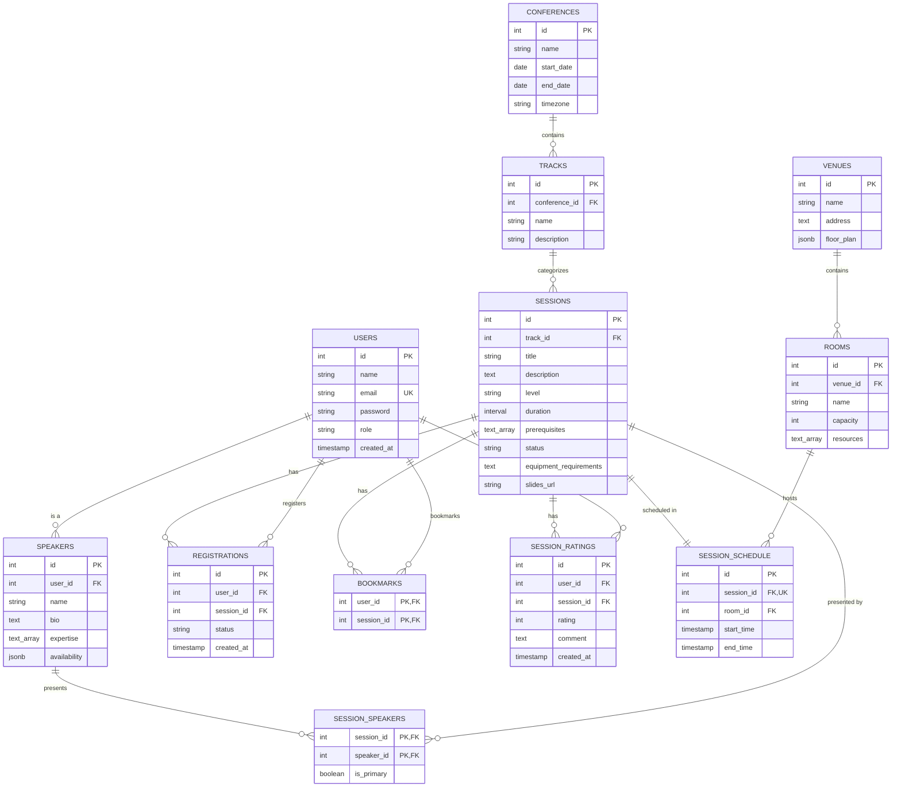

# Database Infrastructure

This document describes the database schema used in the DevOps Conference Session Planner.

## Entity Relationship Diagram (ERD)

```mermaid
erDiagram
    USERS ||--o{ SPEAKERS : "is a"
    USERS ||--o{ REGISTRATIONS : "registers"
    USERS ||--o{ BOOKMARKS : "bookmarks"
    USERS ||--o{ SESSION_RATINGS : "rates"
    
    CONFERENCES ||--o{ TRACKS : "contains"
    TRACKS ||--o{ SESSIONS : "categorizes"
    
    SESSIONS ||--o{ SESSION_SPEAKERS : "presented by"
    SPEAKERS ||--o{ SESSION_SPEAKERS : "presents"
    
    VENUES ||--o{ ROOMS : "contains"
    ROOMS ||--o{ SESSION_SCHEDULE : "hosts"
    SESSIONS ||--|| SESSION_SCHEDULE : "scheduled in"
    
    SESSIONS ||--o{ REGISTRATIONS : "has"
    SESSIONS ||--o{ BOOKMARKS : "has"
    SESSIONS ||--o{ SESSION_RATINGS : "has"

    USERS {
        int id PK
        string name
        string email UK
        string password
        string role
        timestamp created_at
    }

    CONFERENCES {
        int id PK
        string name
        date start_date
        date end_date
        string timezone
    }

    TRACKS {
        int id PK
        int conference_id FK
        string name
        string description
    }

    SESSIONS {
        int id PK
        int track_id FK
        string title
        text description
        string level
        interval duration
        text_array prerequisites
        string status
        text equipment_requirements
        string slides_url
    }

    SPEAKERS {
        int id PK
        int user_id FK
        string name
        text bio
        text_array expertise
        jsonb availability
    }

    VENUES {
        int id PK
        string name
        text address
        jsonb floor_plan
    }

    ROOMS {
        int id PK
        int venue_id FK
        string name
        int capacity
        text_array resources
    }

    SESSION_SPEAKERS {
        int session_id PK, FK
        int speaker_id PK, FK
        boolean is_primary
    }

    SESSION_SCHEDULE {
        int id PK
        int session_id FK, UK
        int room_id FK
        timestamp start_time
        timestamp end_time
    }

    REGISTRATIONS {
        int id PK
        int user_id FK
        int session_id FK
        string status
        timestamp created_at
    }

    BOOKMARKS {
        int user_id PK, FK
        int session_id PK, FK
    }

    SESSION_RATINGS {
        int id PK
        int user_id FK
        int session_id FK
        int rating
        text comment
        timestamp created_at
    }
```
